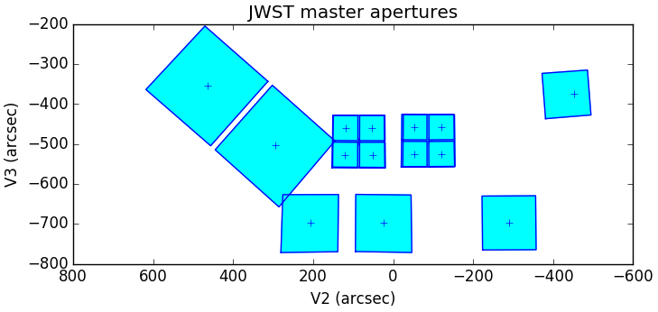
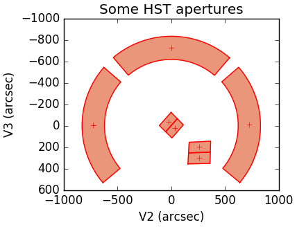

pysiaf
=====
Handling of Science Instrument Aperture Files (SIAF) for space telescopes. SIAF are xml files that contain detailed focal plane and pointing models for the science instruments. They are maintained in the JWST/HST PRD (Project Reference Database). 

pysiaf is a python package to access, interpret, maintain, and generate SIAF, in particular for JWST. Tools for applying the frame transformations, plotting, comparison, and validation are provided.

### Functionalities

* Captures current PRD content, i.e. pysiaf includes a copy of the SIAF XML files. These are maintained to be synchronized with the PRD.
* Transformations between the SIAF frames (Detector, Science, Ideal, Telelescope/V) are pre-loaded and easily accessible.
* Tools for plotting, validation, and comparison of SIAF apertures and files.
* Support for pointing and attitude calculations is provided.
* Input/output: reading SIAF XML, writing XML/Excel/csv etc.
* Captures SI source data and code to generate the SIAF apertures
* Standard python package with installation script, unit tests, documentation.
* Supports working with HST SIAF (read-only).
 

### Usage
Check which PRD version is in use:

    print(pysiaf.JWST_PRD_VERSION)

Frame transformations:

    import pysiaf

    # read SIAFXML
    nis_siaf = pysiaf.Siaf('NIRISS')

    # select single aperture by name
    nis_cen = nis_siaf['NIS_CEN']

    # coordinates in Science frame
    sci_x = np.array([0, 2047, 2047, 0])
    sci_y = np.array([0, 0, 2047, 2047])

    # transform from Science frame to Ideal frame
    idl_x, idl_y = nis_cen.sci_to_idl(sci_x, sci_y)
    
Plotting:

  
  

    

### Disclaimer

Distortion and other transformations in pysiaf are of sufficient accuracy for operations, but do not necessarily have science-grade quality. For instance, generally only one filter solution is carried per aperture.
For science-grade transformations, please consult the science pipelines and their documentation, e.g.     

All parameter values in pysiaf are subject to change. JWST values are preliminary until the JWST observatory commissioning has concluded.    

### Documentation

### References
The pysiaf prototype was developed on gitlab (STScI internal access only) and is kept there for reference: https://grit.stsci.edu/ins-tel/jwst_siaf_prototype

pysiaf partially recycles code from https://github.com/mperrin/jwxml

### Installation
This package was developed in a python 3.5 environment. 

Clone the repository

``git clone https://github.com/spacetelescope/pysiaf``

Install pysiaf:

``cd pysiaf``

``python setup.py install``

### KNOWN INSTALLATION ISSUE

If you get an error upon
    
    import pysiaf

that traces back to 
    
    import lxml.etree as ET
    
and states 
    
    ImportError [...] Library not loaded: libxml2.2.dylib   
    Reason: Incompatible library version: etree.[...] requires version 12.0.0 or later,
    but libxml2.2.dylib provides version 10.0.0
    
this can probably be fixed by downgrading the version of lxml, e.g.
    
    pip uninstall lxml
    pip install lxml==3.6.4
         
